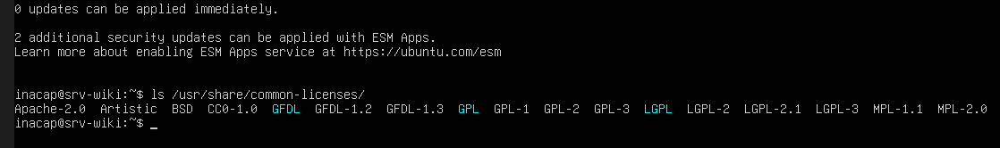

# Licenciamiento y Software Libre

## Concepto de Software Libre
El Software Libre se define como aquel software que respeta la libertad de los usuarios y la comunidad. No se refiere al precio (no es necesariamente "gratis"), sino a la libertad de usar, estudiar, compartir y modificar el programa. Para que un software sea considerado libre, debe garantizar de manera irrestricta las cuatro libertades esenciales:
* **Libertad 0:** Libertad de usar el programa con cualquier propósito.
* **Libertad 1:** Libertad de estudiar cómo funciona el programa y adaptarlo a tus necesidades (el acceso al código fuente es condición necesaria).
* **Libertad 2:** Libertad de distribuir copias para ayudar a otros.
* **Libertad 3:** Libertad de mejorar el programa y hacer públicas las mejoras, de modo que toda la comunidad se beneficie.

---

## Comparativa de Tipos de Licenciamiento
Para entender cómo se distribuye el software en la industria, clasificamos las licencias en tres grandes familias:

### 1. Licencias Robustas o con "Copyleft" (ej. GNU GPL)
* **Definición:** Son licencias que utilizan los derechos de autor para asegurar que el software siga siendo libre incluso tras ser modificado.
* **Mecanismo:** Si un desarrollador toma código bajo una licencia GPL (como la GPLv3), realiza modificaciones y decide distribuir esa nueva versión, está obligado por contrato a liberar el código fuente modificado bajo la misma licencia GPL. No se puede "cerrar" el código.

### 2. Licencias Permisivas (ej. MIT, Apache, BSD)
* **Definición:** Son licencias de software libre extremadamente flexibles y con mínimas restricciones para el usuario.
* **Mecanismo:** Permiten modificar, redistribuir, sublicenciar e incluso vender el software modificado bajo un formato comercial y privativo (código cerrado). El único requisito real es mantener los derechos de autor originales y el aviso de la licencia de los creadores.

### 3. Software Propietario / Comercial
* **Definición:** Es el software que no es libre ni de código abierto.
* **Mecanismo:** El uso, redistribución o modificación están prohibidos o restringidos por el propietario del software. El código fuente no está disponible para el público, y su uso suele requerir el pago de una licencia comercial restrictiva.

---

## Relación con el Entorno del Laboratorio
El sistema operativo y los servicios instalados en nuestra máquina virtual utilizan licencias de código abierto, lo que hace viable y legal este despliegue sin costos asociados:

* **Ubuntu Server 24.04 LTS (Sistema Operativo):** Utiliza principalmente la licencia **GNU GPL (General Public License)**. El kernel de Linux y la mayoría de las herramientas GNU que le dan vida al sistema garantizan que la distribución se mantenga libre y modificable.
* **Nginx (Servidor Web):** Está licenciado bajo la **Licencia BSD de 2 cláusulas** (similar a la simplificada de FreeBSD). Al ser una licencia altamente permisiva, Nginx puede ser integrado en entornos comerciales sin obligar a liberar modificaciones, lo que explica su altísima adopción en el mercado empresarial.

    

Listado de licencias comunes preinstaladas y disponibles en el directorio del sistema Ubuntu Server

