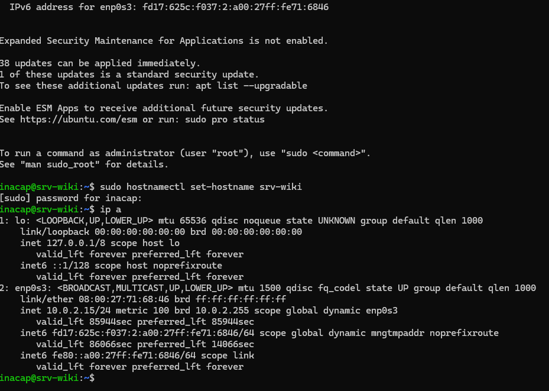
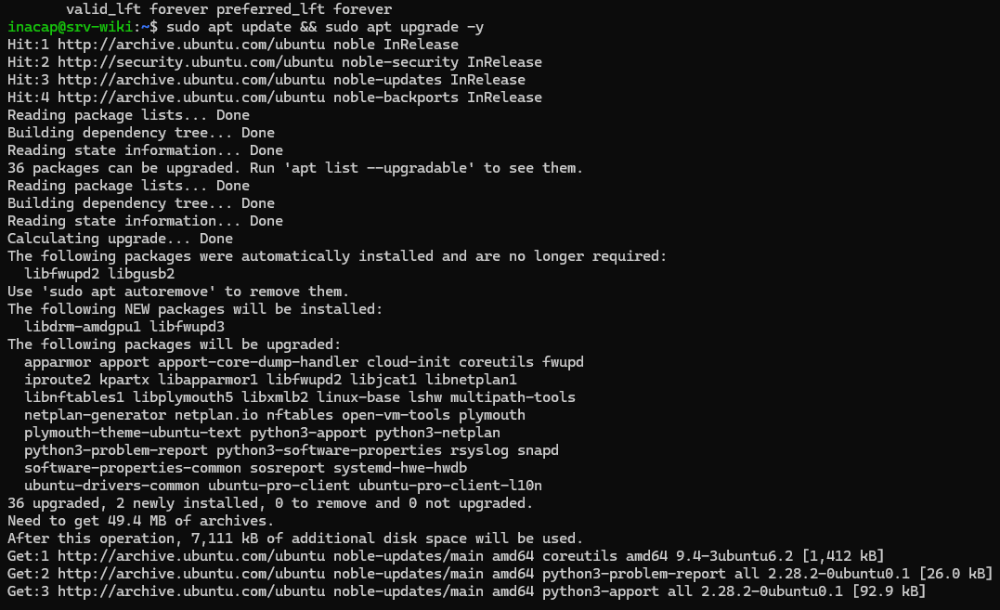
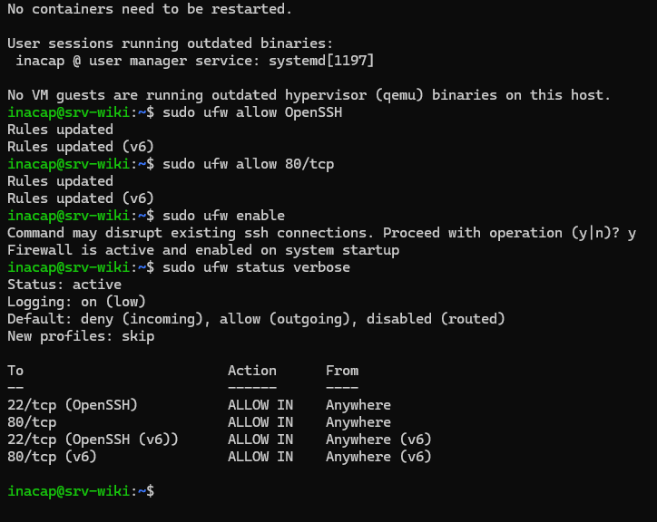

# Criterio 3.1.2 - Instalación y Configuración Básica

## 1. Modificación del Hostname (Nombre del Servidor)
Para identificar de manera única la máquina dentro de la infraestructura, se modificó el hostname del servidor a `srv-wiki` utilizando la herramienta de administración del sistema `hostnamectl`[cite: 2]:

```bash
sudo hostnamectl set-hostname srv-wiki
```

---

## 2. Direccionamiento IP e Interfaz de Red
Para comprobar la configuración de red y la dirección IP que el servidor de VirtualBox (en modo NAT) le asignó a la máquina virtual, se utilizó el comando de administración de interfaces[cite: 2]:

```bash
ip a
```

<div align="center">
    


<p>Consola del servidor donde se evidencia la ejecución de hostnamectl y la salida del comando ip a detallando la dirección IP asignada</p>

</div>


### Investigación de Conceptos de Red

* **NAT (Network Address Translation):** Es un mecanismo que traduce las direcciones IP privadas de la red interna de nuestras máquinas virtuales a una única dirección IP pública para poder salir a internet. Esto permite descargar paquetes de forma segura sin exponer el servidor directamente a la red externa.
* **Reenvío de Puertos:** Dado que el modo NAT aísla la máquina virtual del exterior, el reenvío de puertos actúa como un túnel que asocia un puerto del PC anfitrión a un puerto específico de la VM[cite: 2]. En este laboratorio, redirigir el puerto `2222 -> 22` nos permite conectarnos por SSH, y el puerto `8080 -> 80` nos permite visualizar el sitio de Nginx desde el navegador del PC local.
* **DHCP vs IP Fija:** DHCP (Dynamic Host Configuration Protocol) es un protocolo que asigna automáticamente una dirección IP temporal a un dispositivo cuando se conecta a la red. En cambio, una IP Fija (o estática) es una dirección configurada de forma manual que nunca cambia, lo cual es mandatorio para servidores en producción para asegurar que los servicios web o de base de datos estén siempre accesibles en la misma ruta.

---

## 3. Actualización de Paquetes del Sistema
Mantener el sistema operativo con los últimos parches de seguridad y estabilidad es fundamental. Se actualizaron los repositorios y posteriormente todos los paquetes instalados con el siguiente comando encadenado:

```bash
sudo apt update && sudo apt upgrade -y
```

* **`apt update`:** Descarga y actualiza las listas de paquetes disponibles desde los repositorios de Ubuntu en internet para saber si hay versiones nuevas.
* **`apt upgrade -y`:** Descarga e instala de forma efectiva las actualizaciones de software que estén disponibles. El parámetro `-y` aprueba la instalación automáticamente.

<div align="center">
    


<p>Consola del sistema evidenciando el proceso de descarga e instalación de actualizaciones de seguridad</p>

</div>


---

## 4. Configuración del Firewall (UFW)
Para asegurar el sistema, se utilizó UFW (Uncomplicated Firewall) para bloquear todo el tráfico entrante no deseado, autorizando exclusivamente el acceso remoto por SSH (puerto 22) y el acceso web por HTTP (puerto 80).

Los comandos ejecutados fueron:

```bash
sudo ufw allow OpenSSH
sudo ufw allow 80/tcp
sudo ufw enable
sudo ufw status verbose
```

<div align="center">
    


<p>Comprobación del estado activo de UFW con reglas explícitamente permitidas para los servicios OpenSSH y el puerto TCP 80</p>

</div>

