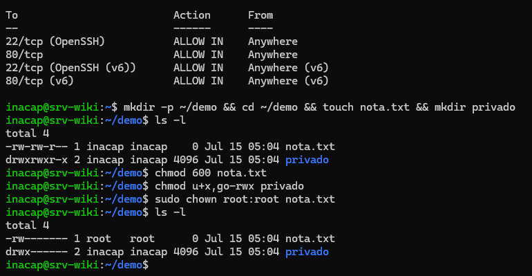
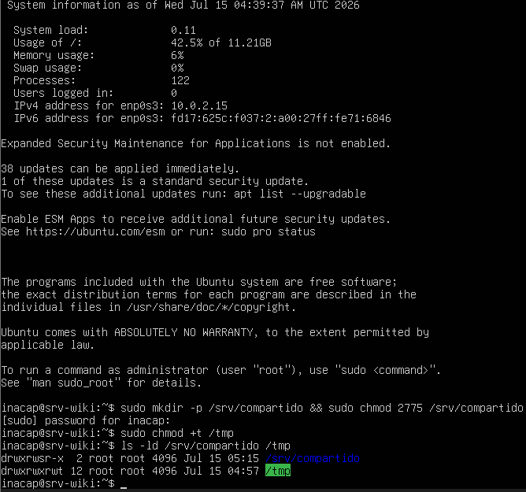

# Gestión de Archivos y Permisos por CLI

## 1. Interpretación de Permisos en Linux
En sistemas basados en Linux, el comando `ls -l` expone de forma detallada los permisos de cada archivo y directorio mediante un bloque de 10 caracteres en la terminal. La estructura se interpreta dividiendo estos caracteres en cuatro secciones clave:

* **Carácter 1 (Tipo):** Indica si es un archivo regular (`-`) o un directorio (`d`).
* **Caracteres 2, 3 y 4 (Dueño/User):** Permisos asignados al usuario propietario del archivo.
* **Caracteres 5, 6 y 7 (Grupo/Group):** Permisos aplicados a los usuarios que pertenecen al grupo del archivo.
* **Caracteres 8, 9 y 10 (Otros/Others):** Permisos de lectura, escritura y ejecución para cualquier otro usuario del sistema.

Cada letra tiene un significado específico y un valor numérico equivalente para configuraciones en modo octal:
* **`r` (Read):** Permiso de lectura. Su valor es **4**.
* **`w` (Write):** Permiso de escritura. Su valor es **2**.
* **`x` (Execute):** Permiso de ejecución. Su valor es **1**.
* **`-`:** Sin permiso asignado. Su valor es **0**.

---

## 2. Modificación de Permisos (Método Numérico vs Simbólico)
Para administrar el acceso en el directorio de pruebas `~/demo/` se utilizaron dos enfoques con el comando `chmod`]:

### Enfoque Numérico (Octal)
Se ejecutó sobre el archivo `nota.txt`:
```bash
chmod 600 nota.txt
```
* **Justificación técnica:** Se calculan los accesos sumando el peso de cada permiso por terna:
  * Dueño: Lectura (4) + Escritura (2) = **6**.
  * Grupo: Sin permisos = **0**.
  * Otros: Sin permisos = **0**.
* Esto convierte los permisos iniciales del archivo en `-rw-------`, garantizando que solo el propietario tenga la capacidad de visualizar y modificar su contenido.

### Enfoque Simbólico
Se ejecutó sobre la carpeta `privado`:
```bash
chmod u+x,go-rwx privado
```
* **Justificación técnica:** Este método aplica modificaciones utilizando letras y operadores aritméticos de forma directa:
  * `u+x`: Agrega el permiso de ejecución (`+x`) al usuario propietario (`u`).
  * `go-rwx`: Remueve simultáneamente los accesos de lectura, escritura y ejecución (`-rwx`) al grupo (`g`) y a otros (`o`).

---

## 3. Cambio de Propietario y Grupo (chown)
En entornos multiusuario, la administración segura requiere restringir la propiedad de archivos críticos. Se cambió el dueño del archivo de notas al superusuario `root`
:

```bash
sudo chown root:root nota.txt
```

* **Impacto:** Este comando redefine al usuario propietario como `root` y al grupo propietario como `root`. Al tener permisos `600` (`-rw-------`)[cite: 2], el usuario común `inacap` pierde de inmediato el acceso de lectura y escritura al archivo, a menos que eleve privilegios utilizando la herramienta `sudo`.

<div align="center">
    


<p>Consola del servidor donde se verifica la correcta lectura de permisos con ls -l y el uso de los comandos chmod y chown</p>

</div>


---

## 4. Aplicación de Permisos Especiales
Para el funcionamiento correcto de aplicaciones web y de almacenamiento compartido en producción, Linux ofrece permisos especiales que van más allá del esquema estándar de seguridad:

### Setgid (Set Group ID)
Se configuró en la ruta compartida `/srv/compartido`
```bash
sudo mkdir -p /srv/compartido && sudo chmod 2775 /srv/compartido
```
* **Funcionamiento:** Representado con una **`s`** en los permisos del grupo (`drwxrwsr-x`). Cuando se activa en un directorio, cualquier archivo o subdirectorio creado dentro de él heredará de forma automática el grupo propietario de la carpeta padre (en este caso, `root`), en lugar de tomar el grupo principal del usuario que crea el archivo. Esto asegura la colaboración continua de múltiples usuarios en directorios de trabajo compartidos.

### Sticky Bit
Se configuró en el directorio temporal común del sistema `/tmp`:
```bash
sudo chmod +t /tmp
```
* **Funcionamiento:** Representado con una **`t`** al final de los permisos de otros (`drwxrwxrwt`)[cite: 2, 3]. Su objetivo es evitar que usuarios regulares puedan borrar o renombrar archivos pertenecientes a otros usuarios dentro de un mismo directorio común, restringiendo el permiso de borrado únicamente al dueño del archivo o al superusuario `root`.

<div align="center">
    


<p>Detalle de ls -ld que constata el bit s activo en /srv/compartido y el bit t en /tmp.</p>

</div>

