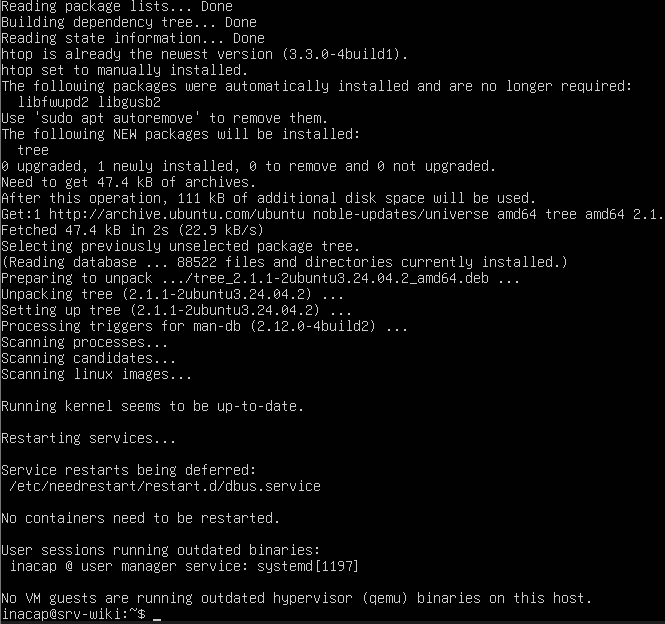

# Gestores de Paquetes (APT) y Criterio de Factibilidad

## 1. El Flujo de Trabajo con APT (Advanced Package Tool)
En distribuciones basadas en Debian/Ubuntu, `apt` es el gestor de paquetes predeterminado para instalar, actualizar y eliminar software de forma segura. Para cumplir con el laboratorio, se ejecutó un flujo completo de búsqueda, análisis y despliegue de una herramienta de monitoreo del sistema:

### Paso A: Búsqueda del Paquete (`apt search`)
Antes de instalar cualquier software, se debe verificar si existe en los repositorios oficiales utilizando el comando:
```bash
apt search htop
```
* **Función:** Realiza una búsqueda por palabra clave en la base de datos de paquetes disponibles localmente.

### Paso B: Análisis y Factibilidad (`apt show`)
Para examinar los metadatos del paquete antes de su descarga, se ejecutó:
```bash
apt show htop
```
* **Función:** Muestra información crítica como la versión exacta, el tamaño de la descarga, las dependencias requeridas, el desarrollador y una descripción detallada de su utilidad.

### Paso C: Instalación Silenciosa (`apt install -y`)
Una vez validado el software, se procedió con la instalación de las herramientas:
```bash
sudo apt install -y htop tree
```
* **Función:** Descarga e instala los paquetes indicados junto con todas sus dependencias de forma automática. El parámetro `-y` (yes) automatiza el proceso aceptando los términos de consumo de disco sin detener la terminal para pedir confirmación interactiva.

<div align="center">
    


<p>Terminal del sistema que evidencia la instalación exitosa del paquete "tree" y la detección de la versión más actualizada de "htop"</p>

</div>


---

## 2. Análisis y Criterio de Factibilidad

Ante la necesidad concreta de implementar un **"Monitor de recursos del sistema"** dentro de nuestro servidor Linux CLI, se evaluaron tres alternativas viables del mercado:

| Criterio de Evaluación | Alternativa 1: `top` (Nativo) | Alternativa 2: `htop` (Elegido) | Alternativa 3: `glances` (Avanzado) |
| :--- | :--- | :--- | :--- |
| **Peso / Consumo** | Nulo (viene preinstalado en el sistema base). | Muy bajo (~111 kB de espacio en disco adicional). | Alto (requiere Python y múltiples dependencias de red). |
| **Complejidad / Interfaz** | Texto plano monócromo, navegación compleja por teclado. | Interfaz semigráfica intuitiva en color, interactiva y modular. | Interfaz enriquecida pero lenta en terminales SSH de baja latencia. |
| **Soporte y Dependencias** | Soporte oficial directo. No requiere dependencias. | Soporte oficial en repositorios Universe. Dependencias mínimas y ligeras. | Soporte externo. Requiere instalar librerías de Python adicionales. |

### Justificación de la Elección (Criterio de Factibilidad)
Se seleccionó **`htop`** como la herramienta idónea para este proyecto por las siguientes razones de factibilidad técnica:
1. **Eficiencia en recursos:** Su instalación requiere un espacio en disco insignificante (~111 kB)[cite: 2] y un consumo de memoria RAM prácticamente nulo, lo cual es ideal para nuestra máquina virtual limitada a 2 GB de RAM.
2. **Interactividad:** A diferencia del comando clásico `top`, `htop` permite visualizar gráficamente el uso de los núcleos del procesador, la memoria RAM y la SWAP en tiempo real, además de permitir la gestión directa de procesos (matar procesos con `F9`, buscar con `F3`) sin tener que memorizar IDs numéricos complejos.
3. **Mantenibilidad:** Se encuentra en los repositorios oficiales de la distribución, lo que asegura que las actualizaciones de seguridad se gestionarán directamente mediante el comando general `apt upgrade` del sistema sin configuraciones adicionales.