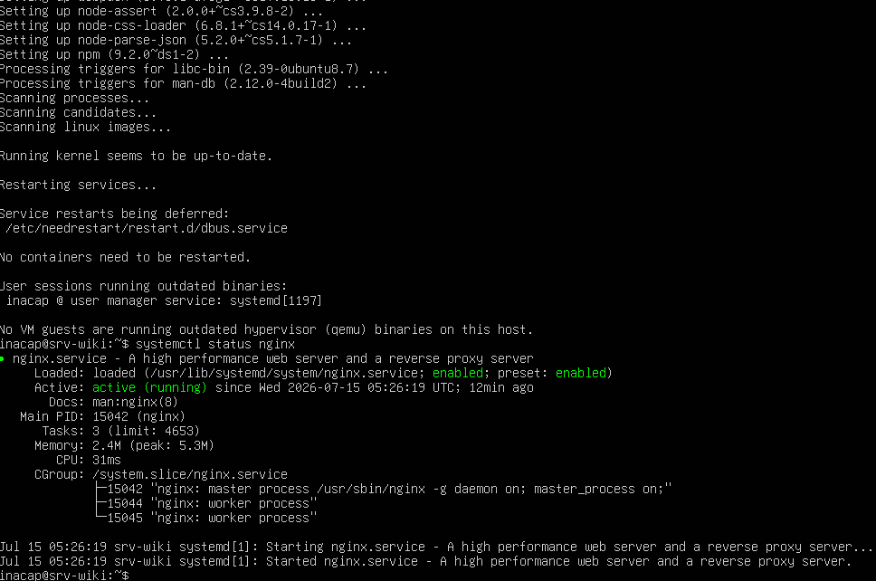
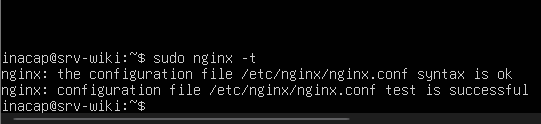

# Nginx y Despliegue de Sitio Web Local

## 1. Instalación de Nginx y Entorno de Ejecución
Para transformar la máquina virtual de Ubuntu Server en un servidor de producción web, se instaló el servidor web de alto rendimiento **Nginx**, junto con el entorno de ejecución **Node.js**, su gestor de paquetes **npm** y **Git** para la clonación y compilación del código fuente:

```bash
sudo apt install -y nginx
sudo apt install -y nodejs npm git
```

Una vez finalizada la instalación, se validó que el servicio de Nginx estuviera activo y configurado de forma correcta para iniciar automáticamente con el sistema operativo:

```bash
systemctl status nginx
```

<div align="center">
    


<p>Consola de Ubuntu Server donde se evidencia el servicio web de Nginx corriendo de forma activa y habilitada (active y running)</p>

</div>


---

## 2. Preparación del Directorio de Hosting y Permisos
Nginx necesita una ruta física estructurada en el disco para almacenar los archivos estáticos (HTML, CSS, JS) de la Wiki. Para ello, se creó un directorio exclusivo y se asignaron los permisos y propietarios correspondientes para evitar fallas de acceso:

```bash
sudo mkdir -p /var/www/wiki
sudo chown -R www-data:www-data /var/www/wiki
sudo chmod -R 755 /var/www
```

* **`/var/www/wiki`:** Es la carpeta física que servirá como raíz del sitio.
* **`www-data`:** Es el usuario y grupo del sistema bajo el cual corre el servicio de Nginx. Asignarlo como propietario mediante `chown` asegura que Nginx pueda leer y servir los archivos compilados del sitio web sin denegaciones de permisos.
* **`chmod 755`:** Otorga permisos de lectura y ejecución a todos los usuarios, permitiendo que Nginx acceda a toda la ruta jerárquica de carpetas.

---

## 3. Creación del Archivo Virtual Host en Nginx
Para indicarle a Nginx en qué puerto escuchar y cuál es la carpeta raíz que debe servir de manera predeterminada, se creó un archivo de configuración de sitio personalizado en `/etc/nginx/sites-available/wiki`:

```nginx
server {
    listen 80 default_server;
    root /var/www/wiki;
    index index.html;
    location / {
        try_files $uri$uri/ /index.html;
    }
}
```

Posteriormente, se activó este nuevo sitio web de la siguiente manera:
1. Se creó un enlace simbólico hacia el directorio de sitios habilitados:
   ```bash
   sudo ln -s /etc/nginx/sites-available/wiki /etc/nginx/sites-enabled/
   ```
2. Se eliminó el enlace del sitio predeterminado que trae Nginx por defecto para evitar conflictos en el puerto 80:
   ```bash
   sudo rm /etc/nginx/sites-enabled/default
   ```
3. Se verificó que el archivo de configuración no presentara errores ortográficos o de sintaxis:
   ```bash
   sudo nginx -t
   ```

<div align="center">
    


<p>Prueba sintáctica exitosa de Nginx (syntax is ok / test is successful)</p>

</div>


Tras confirmar la sintaxis correcta, se recargó el demonio de Nginx para aplicar de forma segura los cambios sin interrumpir el servicio:
```bash
sudo systemctl reload nginx
```

---

## 4. Comprobación del Despliegue Local
Como prueba de concepto y validación del reenvío de puertos NAT (`8080` del anfitrión apuntando al `80` de la VM), se generó un archivo HTML temporal con la leyenda: **"¡Hola Mundo! Servidor Nginx de Geovanni funcionando"** dentro de la raíz `/var/www/wiki/index.html`.

Al ingresar desde la máquina física anfitriona utilizando la dirección de túnel loopback, el servicio resolvió con éxito:

<div align="center">
    


<p>Navegador web del PC anfitrión cargando exitosamente el index del servidor Nginx de la máquina virtual mediante localhost:8080</p>

</div>

